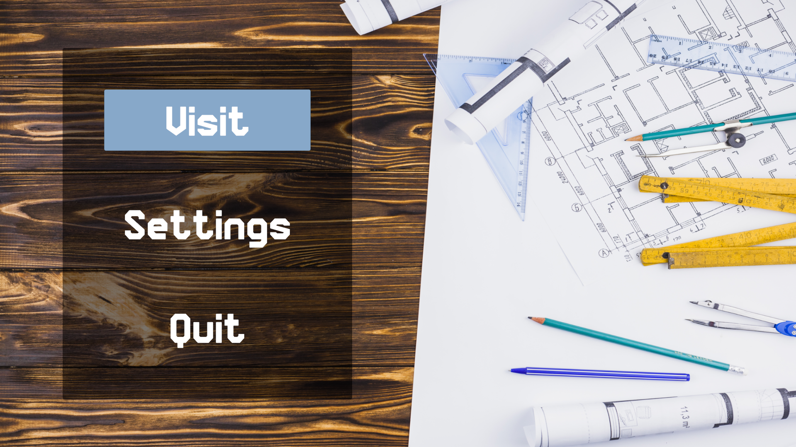
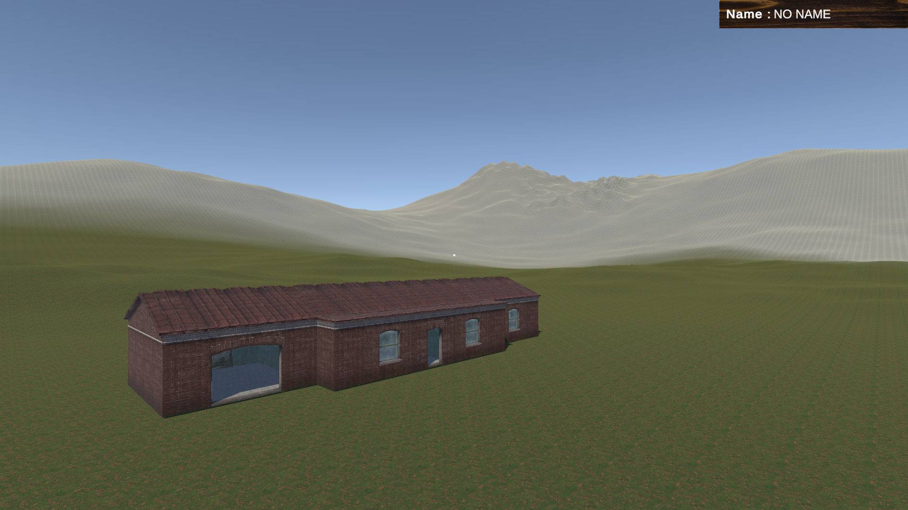
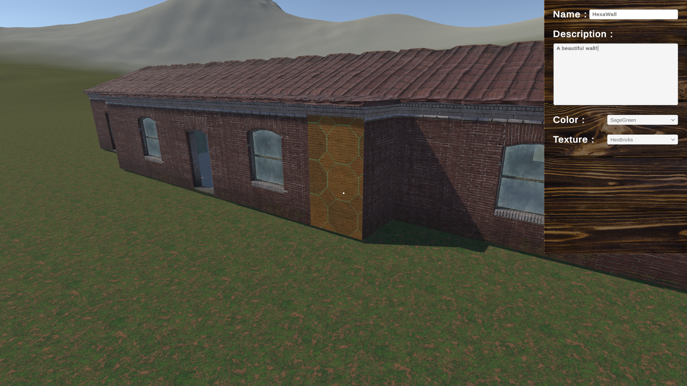
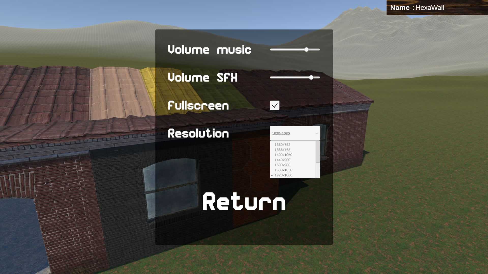

# Mimeo

## Overview
Mimeo is a renovation application where the objective is to navigate through a house model and interact with a selection system. This system allows users to modify the specifications of various parts of the build, such as changing the name, description, color, or texture of elements within the model.> Made in 3 days
> Test asked by Bimeo to get a block release training. Conditions: 5 days

## Table of Contents
- [Features](#features)
- [Technologies Used](#technologies-used)
- [Demo](#demo)
- [Getting Started](#getting-started)
- [License](#license)

## Features
- **Interactive Renovation System**: Navigate through a 3D house model and use the selection system to modify various attributes of the elements within the house. This includes changing colors, textures, and other specifications.

- **Realistic First-Person Controls**: Utilize a first-person controller for an immersive experience while exploring and modifying the house. The controller features sprinting and camera look adjustments to enhance user interaction.

- **Dynamic Audio Feedback**: Experience dynamic audio feedback with various sound effects for actions such as clicking buttons and interacting with elements.

- **Settings Menu**: Adjust game settings including audio levels, screen resolution, and fullscreen mode via a comprehensive settings menu.

## Technologies Used

- **C#**: The core programming language driving the server-side logic, handling backend operations, and implementing dynamic functionalities.

- **Unity**: A powerful game development engine used to create immersive and interactive experiences, providing a comprehensive framework for game design and implementation.

- **Rider**: The JetBrains IDE of choice for C# development in this project. Rider offers a seamless and efficient coding environment, enhancing the development workflow with its robust set of features and tools.

## Demo

## Getting Started

### Open the app
1. Clone the repository: `git clone https://github.com/MaxenceGuidez/Mimeo.git`
2. Open the project in Unity 2022.3.38f1 (or the latest update).
3. Once the project is fully loaded, build it using Ctrl + B.
4. Explore the house model and try the selection system!

### Open the documentation
1. Clone the repository: `git clone https://github.com/MaxenceGuidez/Mimeo.git`
2. Download and install [http-server](https://www.npmjs.com/package/http-server) via npm
3. Open your terminal and go to the doc folder (.../Mimeo/doc)
4. Run the command `http-server ./` (if not working try `npx http-server`)
5. Open http://localhost:8080 in a web browser.

## License

This project is licensed under the MIT License - see the [LICENSE.md](LICENSE.md) file for details.